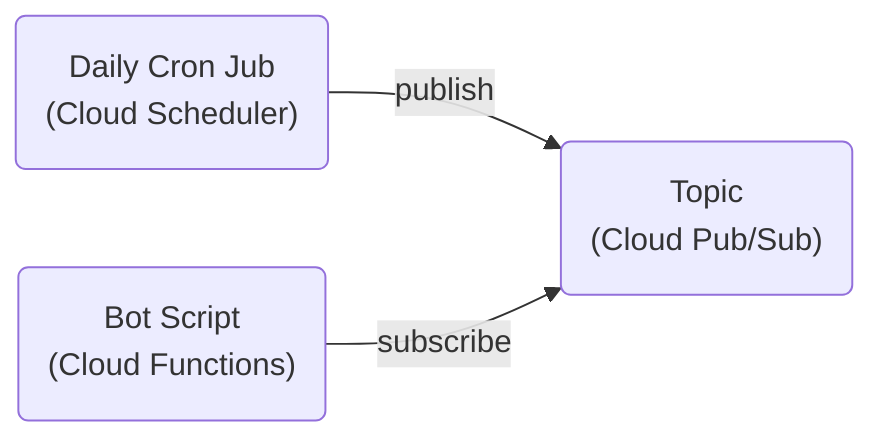

# 🤖 MEV Watch Bot

Post daily update of Ethereum OFAC-compliant block rate on Twitter ([MEV Watch Bot](https://twitter.com/mevwatchbot)). Screenshot and statistics are obtained from [MEV Watch](https://www.mevwatch.info/).

## Requirements

Service/API used in this bot.

### Google Cloud

-   Create a [Google Cloud](https://cloud.google.com) account and a project.
-   Set up a [Scheduler](https://cloud.google.com/secret-manager/docs/create-secret) for the daily
    cron job.
-   Set up a [Pub/Sub](https://cloud.google.com/pubsub/docs/publish-receive-messages-console) topic.
-   Install the [`gcloud`](https://cloud.google.com/sdk/gcloud) command line tool.

#### Architecture

The cron job will publish an event to the topic daily, triggering the bot function to execute its
logic to get screenshot of and request historical data from the MEV Watch website, then upload the
screenshot and compose a tweet to post on Twitter.

### Twitter

-   Create a [developer account](https://developer.twitter.com/en/apply-for-access) and an app. Then
    put the secret tokens in a .env file. (Refer to [.env.example](./.env.example). Also,
    recommend setting up [direnv](https://direnv.net/) to [auto-load](https://direnv.net/man/direnv.toml.1.html#codeloaddotenvcode) .env when entering project directory.)
-   Configure the app's "User authentication settings" to have "Read and write" app permissions. As
    for the "Callback URI" and "Website URL" in the "App Info" section, we can set it to anything (e.g.
    just https://twitter.com).
-   Apply for [elevated access](https://developer.twitter.com/en/portal/products/elevated) since
    some of the APIs used here need it.
-   Create another Twitter account for the bot. (To obtian an email account for this, I would
    recommend [Proton Mail](https://proton.me/), since they doesn't ask for personal info when
    createing an account.)
-   Optionally set up [automated account label](https://help.twitter.com/en/using-twitter/automated-account-labels) for the bot.

#### One-Time Authorization for the Bot Account

After setting up the accounts, we'll need gain permission to tweet on behalf of the bot account.

1. Log in to the bot account in the browser.
2. Run `yarn auth`.
3. Go to the link shown in the console with the same browser as in Step 1.
4. Copy the PIN code and input to the console.

The secret tokens for the bot accounts will then be appended to the `.env` file. Store them in
Google Cloud [Secret Manager](https://cloud.google.com/secret-manager/docs/create-secret).

## Deploy

-   `yarn lint`: code formatting and linting.
-   `yarn deploy`: build and deploy the bot.
-   `yarn trigger`: manually trigger the bot function (often used for testing).

> **Note**
> The first time deploying the bot to Google Cloud, some warnings and errors will pop up asking for
> permissions, e.g. granting default service account access to Secret Manager. Simply follow the
> hints and set up the required permissions to proceed.

## License

[MIT](./LICENSE)
